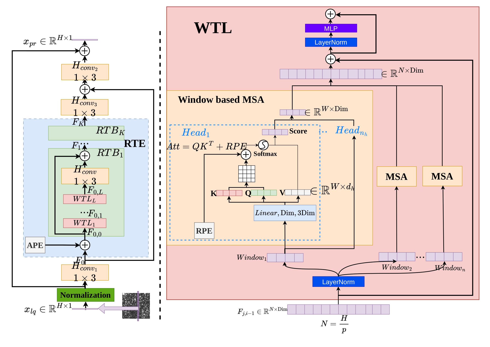
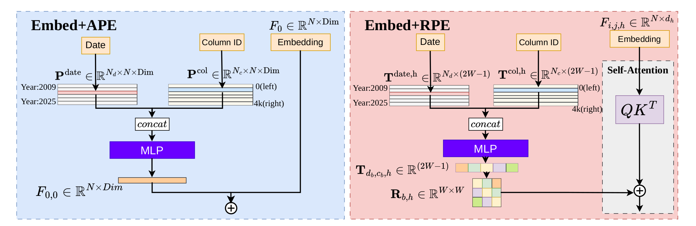
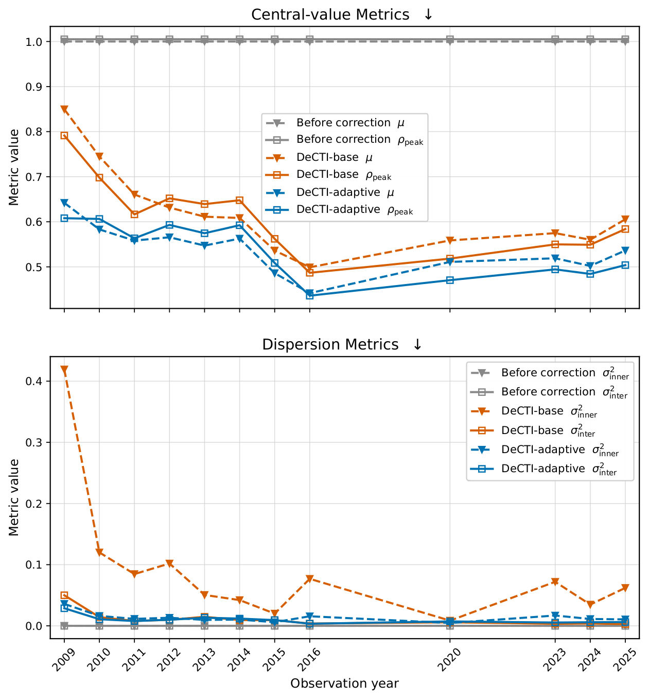
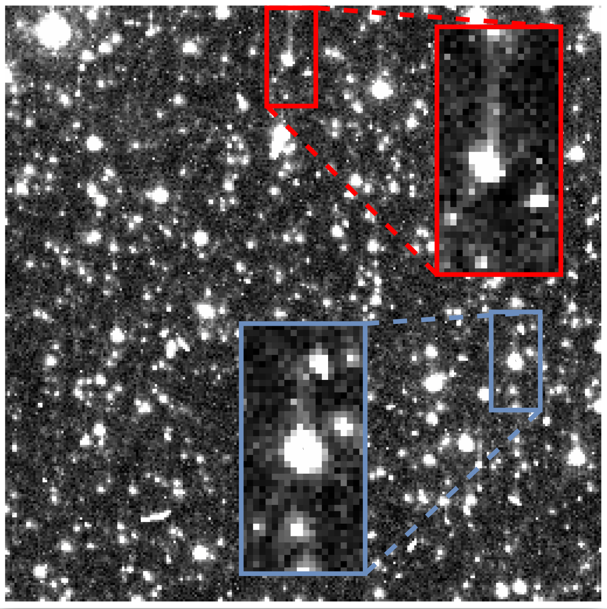
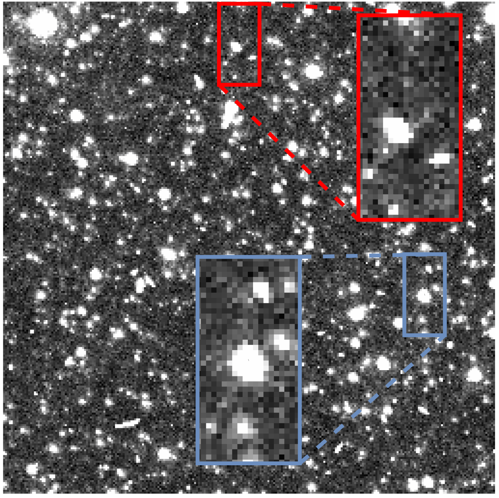
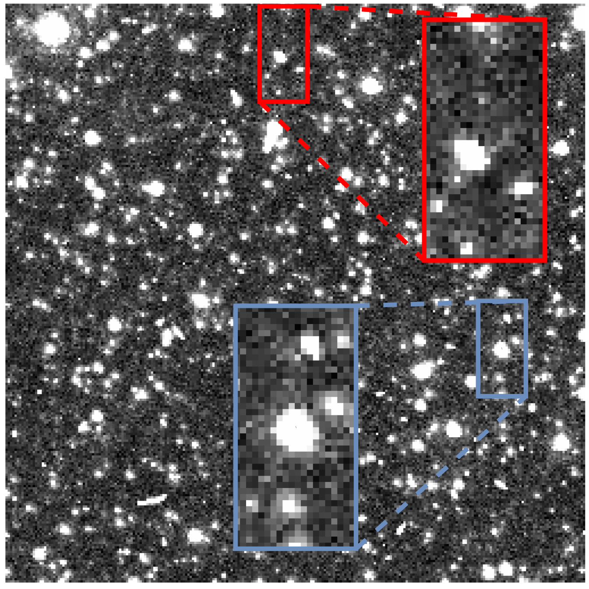

# DeCTI: Transformer-based Charge Transfer Inefficiency Correction

Official implementation of **DeCTI**, a supervised deep-learning framework for column-wise charge transfer inefficiency (CTI) correction in astronomical CCD images.

This repository contains both models described in the manuscript:

| Paper name | Code class | Entry script | Positional encoding |
|---|---|---|---|
| **DeCTI-base** | `DeCTIAbla` | `baseline.sh` | One APE and RPE shared by all samples |
| **DeCTI-adaptive** | `DeCTIMPE` | `adaptive.sh` | Observation-epoch- and detector-column-conditioned APE and RPE |

The research class names are kept unchanged for checkpoint and code compatibility.

## Method

DeCTI reformulates CTI correction as a 1-D sequence-to-sequence restoration problem. Each detector column is treated as one sample. Convolutional layers extract local features, while fixed-window Transformer blocks model longer-range charge-trailing dependencies.

<p align="center">
  
</p>
<p align="center"><em>DeCTI-base training and inference pipeline.</em></p>

### DeCTI-base

For an uncorrected HST/ACS `flt.fits` image, arrays from FITS extensions 1 and 4 are concatenated into a (4096 × 4096) image. Its 4096 columns are processed as independent length-4096 sequences. The paired, pipeline-corrected `flc.fits` image supplies the supervision target. Training minimizes mean squared error in the normalized domain; inference reverses the normalization and reconstructs the two FITS science extensions.

### DeCTI-adaptive

CTI degradation changes with detector age and detector location. DeCTI-adaptive retains the DeCTI-base backbone and conditions both absolute and relative positional encodings on:

- an observation-epoch ID: 34 half-year bins from 2009 through 2025; and
- a detector-column ID: 64 bins, each covering 64 of the 4096 columns.

For both APE and RPE, the selected date and column embeddings are concatenated and fused by an MLP (`--multi_ape 4 --multi_rpe 4`).

<p align="center">
  
</p>
<p align="center"><em>Observation-epoch- and detector-column-conditioned APE and RPE in DeCTI-adaptive.</em></p>

The training and inference data flow is the same for both models. The only additional inference inputs for DeCTI-adaptive are `DATE-OBS` / `TIME-OBS` from the FITS header and the column index; no corrected reference image is used by the model at inference time.

## Results overview

Both models reduce CTI-induced deviations relative to uncorrected images. On the multi-year experiment, DeCTI-adaptive is designed to provide more stable behavior across observation epochs by explicitly modeling temporal and spatial detector conditions.

<p align="center">
  
</p>
<p align="center"><em>Multi-year comparison using the CTI-specific removal-ratio metrics. Lower is better.</em></p>

Example restoration:

<p align="center">
  
  
  
</p>
<p align="center"><em>Uncorrected input (left), DeCTI prediction (middle), and reference target (right).</em></p>

The manuscript additionally evaluates photometric, morphological, astrometric, image-quality, and CTI-specific diagnostics. Since real observations do not provide an exact CTI-free reference, the calibrated HST `flc.fits` products are used as reference targets; this limitation should be considered when interpreting the results.

## Installation

Create the provided Conda environment:

```bash
conda env update -f environment.yaml
conda activate base
```

The main dependencies include PyTorch, timm, NumPy, pandas, Astropy, fitsio, scikit-learn, matplotlib, seaborn, and TensorBoard.

## Data

The experiments use public HST/ACS F814W observations from MAST. For every exposure, place the paired files under the same observation directory:

```text
/path/to/HST_F814W/
└── <observation_id>/
    ├── <observation_id>_flt.fits   # uncorrected model input
    └── <observation_id>_flc.fits   # supervised reference target
```

The repository provides relative-path CSV manifests:

- `config/multi_year/`: the paper's balanced multi-year split (600 train, 163 validation, 1367 test entries);
- `config/remove_j92t/`: the legacy split retained for compatibility.

Each CSV contains `date`, `gt`, and `lq` columns. The listed data are not redistributed by this repository. They can be downloaded from MAST using the observation IDs in the relative paths, for example with [astroquery](https://astroquery.readthedocs.io/en/latest/esa/hubble/hubble.html).

## Training

All paths are configured through environment variables. A single-GPU run uses `NPROC_PER_NODE=1`; increase it for single-node distributed training.

DeCTI-base:

```bash
DATA_DIR=/path/to/HST_F814W \
NPROC_PER_NODE=1 \
MODE=train \
./baseline.sh
```

DeCTI-adaptive:

```bash
DATA_DIR=/path/to/HST_F814W \
NPROC_PER_NODE=1 \
MODE=train \
./adaptive.sh
```

Useful overrides include `CONFIG_DIR`, `LOG_PATH`, `PRED_DIR`, `RUN_NAME`, and `BATCH_SIZE`. The scripts use the paper configuration: patch size 1, attention-window size 64, six residual Transformer groups with six layers each, embedding width 96, and MSE loss.

## Inference

Set `MODE=infer` and point `CHECKPOINT_RUN` to a run directory below `LOG_PATH`. If it is omitted, the script loads the checkpoint from `RUN_NAME`.

```bash
# DeCTI-base
DATA_DIR=/path/to/HST_F814W \
LOG_PATH=/path/to/runs \
CHECKPOINT_RUN=decti_base \
MODE=infer \
BATCH_SIZE=512 \
./baseline.sh

# DeCTI-adaptive
DATA_DIR=/path/to/HST_F814W \
LOG_PATH=/path/to/runs \
CHECKPOINT_RUN=decti_adaptive \
MODE=infer \
BATCH_SIZE=512 \
./adaptive.sh
```

Checkpoints are expected at `<LOG_PATH>/<CHECKPOINT_RUN>/checkpoint.pth`. Predictions are written below `<PRED_DIR>/<RUN_NAME>/`.

## Direct entry point

The scripts are thin wrappers around `main.py`. The key model selections are:

```bash
# DeCTI-base
torchrun --standalone --nproc_per_node=1 main.py \
  --model DeCTIAbla --multi_ape 4 --multi_rpe 4 ...

# DeCTI-adaptive
torchrun --standalone --nproc_per_node=1 main.py \
  --model DeCTIMPE --multi_ape 4 --multi_rpe 4 ...
```

The `multi_ape` and `multi_rpe` arguments are used only by `DeCTIMPE`; they are accepted in the base command to keep shared launch configurations simple.

## Repository structure

```text
CSST-DeCTI/
├── adaptive.sh                 # DeCTI-adaptive training/inference
├── baseline.sh                 # DeCTI-base training/inference
├── config/
│   ├── multi_year/             # paper multi-year data split
│   └── remove_j92t/            # legacy split
├── data_provider/              # FITS datasets and data factories
├── figs/                       # manuscript and evaluation figures
├── models/
│   ├── DeCTIAbla.py            # DeCTI-base (compatibility class name)
│   ├── DeCTIMPE.py             # DeCTI-adaptive (compatibility class name)
│   └── DnCNN.py
├── pipeline/
│   ├── exp_basic.py
│   └── exp_main.py
├── utils/tools.py
├── environment.yaml
├── LICENSE
├── main.py
└── README.md
```

## Citation

If this code is useful in your research, please cite the manuscript:

```bibtex
@article{men2026decti,
  title   = {DeCTI: Transformer-based Charge Transfer Inefficiency correction},
  author  = {Men, Zehua and Shao, Li and Li, Guoliang and Duan, Manni},
  year    = {2026},
  note    = {Manuscript}
}
```

## Acknowledgements and license

This work is based on observations made with the NASA/ESA Hubble Space Telescope and obtained from the Mikulski Archive for Space Telescopes (MAST). It is also supported by the China Manned Space Program through its Space Application System.

The source code is released under the [Apache License 2.0](LICENSE). HST data hosted by MAST are not included in this repository and remain subject to their applicable data policies.
